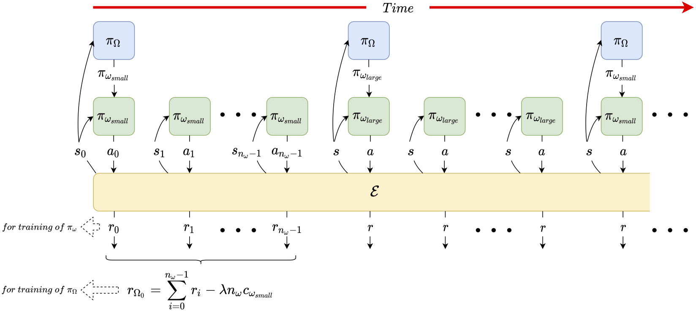
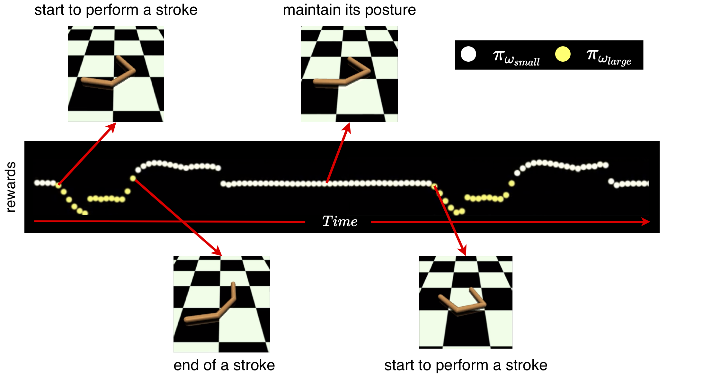
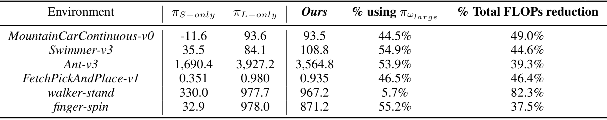

# Computational Cost-Aware Control Using Hierarchical Reinforcement Learning

This repository is the official implementation of "Computational Cost-Aware Control Using Hierarchical Reinforcement Learning".



The methodology performs cost-aware control based on the HRL framework. The master policy is trained to take computational costs into its consideration, such that the two sub-policies are used for task segments with different control complexities. This methodology is able to provide sufficient performances while reducing the computational costs required for completing the tasks.




This repository is modified and based on the implementation of [Stable Baselines](https://github.com/hill-a/stable-baselines) and [RL Baselines Zoo](https://github.com/araffin/rl-baselines-zoo). The training procedure and DQN model are modified to adapt to our methodology.

## Dependencies
- Python == 3.7
- tensorflow == 1.14.0
- OpenAI gym (gym) == 0.17.1
- matplotlib (with TkAgg backend)
- mujoco-py == 2.0.2.9
- numpy == 1.17.4
- PyVirtualDisplay == 0.2.5

## Installation
```
# git clone this repo and enter this repo
pip install -r requirement.txt
sudo apt-get update && sudo apt-get install cmake libopenmpi-dev python3-dev zlib1g-dev
cd stable-baselines
pip install -e .
```

## Training
Training examples:

```train
# Change current directory to rl-zoo, then use one of the following commands
cd rl-zoo

# For DeepMind Control Suite
python train_decision_net.py --algo dqn --domain walker --task run --sub-policy-costs 1 18.1  --policy-cost-coef 1e-3
# For MuJoCo Environments from OpenAI Gym
python train_decision_net.py --algo dqn --env Swimmer-v3 --sub-hidden-sizes 8 256 --sub-policy-costs 1 424.8 --policy-cost-coef 1e-4
# For Fetch Environments from OpenAI Gym
python train_decision_net.py --algo her --env FetchPickAndPlace-v1 --sub-hidden-sizes 32 128 --sub-policy-costs 9.4 --policy-cost-coef 2e-4
```

* The `algo` option is the RL algorithm used to train the master policy. It supports `her` only for *Fetch*  Environments provided by OpenAI Gym. It supports `dqn` for the other environments.
* Use different `domain` and `task` option to train different environments from **DeepMind Control Suite**. Use different `env` option to train environments from **OpenAI Gym**. Please take a look at **rl-zoo/hyperparams/dqn.yml** to see valid environments.
* The `sub-hidden-sizes` option sets the number of neurons per layer for the small and the large sub-policies.
* The `sub-policy-costs` option defines the policy cost for the small and large sub-policies.
* The `policy-cost-coef` option defines the importance of the policy cost term in the loss function.

### Evaluation
* To evaluate or using a trained model, set the `trained-agent-folder` to the folder with trained models.
```evaluation
python train_decision_net.py --algo dqn --env Swimmer-v3 --sub-hidden-sizes 8 256 --trained-agent-folder ./logs/dqn/Swimmer-v3_1
```

## Results

